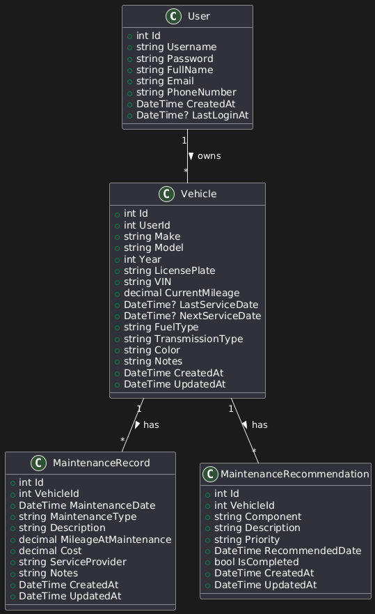

# AutoCarePro - Vehicle Maintenance Tracker

## Project Overview
AutoCarePro is a desktop application designed to help car owners and maintenance centers track vehicle maintenance schedules, expenses, and diagnostics. The application provides automated maintenance recommendations and priority-based alerts to ensure vehicles are properly maintained.

## Features
- User authentication (Car Owners and Maintenance Centers)
- Vehicle management and tracking
- Maintenance history recording
- Automated maintenance recommendations
- Priority-based alerts
- Maintenance cost tracking
- Service provider management
- Diagnosis and real-time recommendations (for maintenance centers)
- Data export (CSV)

## User Type Abilities and Access Levels

### 1. Car Owner
- **Dashboard:**
  - View their own vehicles.
  - See maintenance recommendations and alerts for their vehicles.
  - Quick actions: Add vehicle, add maintenance record, view maintenance history.

- **Vehicle Management:**
  - Add new vehicles.
  - Edit or delete their own vehicles.
  - View detailed vehicle information.

- **Maintenance Records:**
  - Add maintenance records for their vehicles.
  - View maintenance history for their vehicles.
  - Filter and sort maintenance records.

- **Recommendations:**
  - View automated maintenance recommendations (e.g., oil change alerts).
  - Mark recommendations as completed.

- **Data Export:**
  - Export maintenance history to CSV.

### 2. Maintenance Center
- **Dashboard:**
  - View all vehicles (from all car owners).
  - See maintenance recommendations and alerts for all vehicles.
  - Quick actions: Add maintenance record, view maintenance history.

- **Vehicle Management:**
  - View all vehicles (cannot add, edit, or delete vehicles).
  - View detailed vehicle information for any vehicle.

- **Maintenance Records:**
  - Add maintenance records for any vehicle.
  - View maintenance history for any vehicle.
  - Filter and sort maintenance records.
  - Enter car owner's username/ID when adding maintenance records to prevent conflicts.
  - Link maintenance records to specific car owners for better tracking.

- **Recommendations:**
  - View automated maintenance recommendations for all vehicles.
  - Mark recommendations as completed.
  - Add real-time recommendations during vehicle diagnosis.
  - Create immediate maintenance alerts for critical issues (e.g., engine fan needs replacement).
  - Track diagnosis-based recommendations separately from automated ones.

- **Diagnosis Features:**
  - Add recommendations while performing vehicle diagnosis.
  - Create immediate maintenance alerts for critical issues.
  - Link recommendations to specific maintenance records.
  - Set priority levels for diagnosis-based recommendations.

- **Data Export:**
  - Export maintenance history to CSV for any vehicle.
  - Export diagnosis reports with recommendations.

### Summary Table
| Feature                        | Car Owner | Maintenance Center |
|--------------------------------|-----------|-------------------|
| View Own Vehicles              | ✅         | ❌                 |
| View All Vehicles              | ❌         | ✅                 |
| Add Vehicle                    | ✅         | ❌                 |
| Edit/Delete Vehicle            | ✅         | ❌                 |
| Add Maintenance Record         | ✅         | ✅                 |
| View Maintenance History       | ✅         | ✅                 |
| View Recommendations           | ✅         | ✅                 |
| Export Data                    | ✅         | ✅                 |
| Add Diagnosis Recommendations  | ❌         | ✅                 |
| Link Records to Owners         | ❌         | ✅                 |

## Project Structure
```
AutoCarePro/
├── Models/
│   ├── Vehicle.cs (Base class)
│   ├── Car.cs (Inherits from Vehicle)
│   ├── MaintenanceRecord.cs
│   ├── MaintenanceRecommendation.cs
│   ├── DiagnosisRecommendation.cs
│   └── User.cs
├── Forms/
│   ├── LoginForm.cs
│   ├── CarInfoForm.cs
│   ├── MaintenanceEntryForm.cs
│   ├── DashboardForm.cs
│   ├── MaintenanceHistoryForm.cs
│   ├── AddMaintenanceForm.cs
│   └── DiagnosisForm.cs
└── Services/
    ├── DatabaseService.cs
    └── RecommendationEngine.cs
```

## Database Schema Overview

### Tables and Columns

#### 1. Users
| Column         | Type             | Description                |
|---------------|------------------|----------------------------|
| Id            | INT (PK)         | User ID (Primary Key)      |
| Username      | NVARCHAR(50)     | Unique username            |
| Password      | NVARCHAR(100)    | Hashed password            |
| FullName      | NVARCHAR(100)    | Full name                  |
| Email         | NVARCHAR(100)    | Unique email address       |
| PhoneNumber   | NVARCHAR(20)     | Phone number               |
| CreatedAt     | DATETIME         | Account creation date      |
| LastLoginAt   | DATETIME         | Last login date            |
| Type          | NVARCHAR(30)     | User type (Car Owner, Maintenance Center) |

#### 2. Vehicles
| Column           | Type             | Description                        |
|------------------|------------------|------------------------------------|
| Id               | INT (PK)         | Vehicle ID (Primary Key)           |
| UserId           | INT (FK)         | References Users(Id)               |
| Make             | NVARCHAR(50)     | Manufacturer                       |
| Model            | NVARCHAR(50)     | Model                              |
| Year             | INT              | Year of manufacture                |
| LicensePlate     | NVARCHAR(20)     | License plate                      |
| VIN              | NVARCHAR(17)     | Vehicle Identification Number      |
| CurrentMileage   | DECIMAL(10,2)    | Current mileage                    |
| LastServiceDate  | DATETIME         | Last service date                  |
| NextServiceDate  | DATETIME         | Next service date                  |
| FuelType         | NVARCHAR(20)     | Fuel type                          |
| TransmissionType | NVARCHAR(20)     | Transmission type                  |
| Color            | NVARCHAR(30)     | Color                              |
| Notes            | NVARCHAR(MAX)    | Additional notes                   |
| CreatedAt        | DATETIME         | Record creation date               |
| UpdatedAt        | DATETIME         | Last update date                   |

#### 3. MaintenanceRecords
| Column               | Type             | Description                        |
|----------------------|------------------|------------------------------------|
| Id                   | INT (PK)         | Record ID (Primary Key)            |
| VehicleId            | INT (FK)         | References Vehicles(Id)            |
| MaintenanceDate      | DATETIME         | Date of maintenance                |
| MaintenanceType      | NVARCHAR(50)     | Type of maintenance                |
| Description          | NVARCHAR(200)    | Description of work                |
| MileageAtMaintenance | DECIMAL(10,2)    | Mileage at maintenance             |
| Cost                 | DECIMAL(10,2)    | Cost of maintenance                |
| ServiceProvider      | NVARCHAR(100)    | Service provider                   |
| Notes                | NVARCHAR(MAX)    | Additional notes                   |
| CreatedAt            | DATETIME         | Record creation date               |
| UpdatedAt            | DATETIME         | Last update date                   |
| DiagnosedByUserId    | INT (FK, NULL)   | References Users(Id), nullable     |
| HasDiagnosisRecommendations | BIT        | If there are diagnosis-based recs  |

#### 4. MaintenanceRecommendations
| Column           | Type             | Description                        |
|------------------|------------------|------------------------------------|
| Id               | INT (PK)         | Recommendation ID (Primary Key)    |
| VehicleId        | INT (FK)         | References Vehicles(Id)            |
| Component        | NVARCHAR(50)     | Component needing attention        |
| Description      | NVARCHAR(200)    | Recommendation details             |
| Priority         | NVARCHAR(20)     | Priority (e.g., Critical, Medium)  |
| RecommendedDate  | DATETIME         | When to perform maintenance        |
| IsCompleted      | BIT              | Whether completed                  |
| CreatedAt        | DATETIME         | Record creation date               |
| UpdatedAt        | DATETIME         | Last update date                   |

#### 5. DiagnosisRecommendations
| Column               | Type             | Description                        |
|----------------------|------------------|------------------------------------|
| Id                   | INT (PK)         | Diagnosis Recommendation ID        |
| MaintenanceRecordId  | INT (FK)         | References MaintenanceRecords(Id)  |
| DiagnosedByUserId    | INT (FK)         | References Users(Id)               |
| Component            | NVARCHAR(50)     | Component needing attention        |
| Description          | NVARCHAR(200)    | Recommendation details             |
| Priority             | NVARCHAR(20)     | Priority (Critical, High, etc.)    |
| EstimatedCost        | DECIMAL(10,2)    | Estimated cost to fix              |
| RecommendedDate      | DATETIME         | When to perform maintenance        |
| IsCompleted          | BIT              | Whether completed                  |
| CreatedAt            | DATETIME         | Record creation date               |
| UpdatedAt            | DATETIME         | Last update date                   |

### Relationships
- **Users (1) — (M) Vehicles:** Each user can have multiple vehicles. Each vehicle belongs to one user.
- **Vehicles (1) — (M) MaintenanceRecords:** Each vehicle can have multiple maintenance records. Each record is linked to one vehicle.
- **Vehicles (1) — (M) MaintenanceRecommendations:** Each vehicle can have multiple recommendations. Each recommendation is linked to one vehicle.
- **MaintenanceRecords (1) — (M) DiagnosisRecommendations:** Each maintenance record can have multiple diagnosis recommendations.

**Legend:**
- (PK): Primary Key
- (FK): Foreign Key
- (1): One
- (M): Many

## UML Class Diagram



---

## Workflow Chart
```
┌────────────────────────────────────────────────────────────────────────────┐
│                              Application Start                            │
└───────────────────────────────┬────────────────────────────────────────────┘
                                │
                                ▼
┌────────────────────────────────────────────────────────────────────────────┐
│                           Login / Registration                            │
└───────────────────────────────┬────────────────────────────────────────────┘
                                │
                                ▼
┌────────────────────────────────────────────────────────────────────────────┐
│                                 Dashboard                                 │
└───────────────┬───────────────┬───────────────┬────────────────────────────┘
                │               │               │
                ▼               ▼               ▼
┌───────────────┴───┐   ┌───────┴───────┐   ┌──┴───────────────┐
│   Vehicle         │   │  Maintenance  │   │  Recommendations │
│   Management      │   │  History      │   │  & Alerts        │
└─────────┬─────────┘   └───────┬───────┘   └────────┬─────────┘
          │                     │                    │
          ▼                     ▼                    ▼
┌─────────────────┐   ┌─────────────────┐   ┌──────────────────────────────┐
│ Add/Edit        │   │ View/Filter     │   │ View Priority Alerts         │
│ Vehicle Details │   │ Maintenance     │   │ View Automated & Diagnosis   │
└─────────────────┘   │ Records         │   │ Recommendations              │
                      └─────────────────┘   └─────────────┬────────────────┘
                                                        │
                                                        ▼
                                         ┌──────────────────────────────┐
                                         │ Add/Edit/Complete           │
                                         │ Recommendations             │
                                         └──────────────────────────────┘

┌────────────────────────────────────────────────────────────────────────────┐
│                        Maintenance Center Workflow                        │
└───────────────────────────────┬────────────────────────────────────────────┘
                                │
                                ▼
┌────────────────────────────────────────────────────────────────────────────┐
│ Add Maintenance Record (with Owner ID) / Add Diagnosis                     │
└───────────────────────────────┬────────────────────────────────────────────┘
                                │
                                ▼
┌────────────────────────────────────────────────────────────────────────────┐
│ Diagnosis Form: Add Recommendations, Set Priority, Estimated Cost, etc.    │
└───────────────────────────────┬────────────────────────────────────────────┘
                                │
                                ▼
┌────────────────────────────────────────────────────────────────────────────┐
│ Save Diagnosis & Recommendations (Linked to Maintenance Record)            │
└────────────────────────────────────────────────────────────────────────────┘

┌────────────────────────────────────────────────────────────────────────────┐
│                        Car Owner Workflow                                 │
└───────────────────────────────┬────────────────────────────────────────────┘
                                │
                                ▼
┌────────────────────────────────────────────────────────────────────────────┐
│ Add/Edit Vehicle, Add Maintenance Record                                  │
└───────────────────────────────┬────────────────────────────────────────────┘
                                │
                                ▼
┌────────────────────────────────────────────────────────────────────────────┐
│ View Maintenance History, Recommendations, and Alerts                     │
└────────────────────────────────────────────────────────────────────────────┘

```

## Setup Instructions
1. Clone the repository
2. Open the solution in Visual Studio
3. Restore NuGet packages
4. Build the solution
5. Run the application

## Development Guidelines
- Use C# coding conventions
- Follow SOLID principles
- Document code with XML comments
- Write meaningful commit messages
- Test features before committing

## Communication
- Use GitHub Issues for bug tracking
- Create pull requests for code review
- Document major changes in commit messages
- Keep the team updated on progress

## Important Notes
- Always pull latest changes before starting work
- Test your changes before committing
- Ask for help if stuck
- Keep code clean and well-documented

## Resources
- [C# Documentation](https://docs.microsoft.com/en-us/dotnet/csharp/)
- [Windows Forms Guide](https://docs.microsoft.com/en-us/dotnet/desktop/winforms/?view=netdesktop-6.0)
- [Entity Framework Documentation](https://docs.microsoft.com/en-us/ef/)

## Contact
- Ahmed Hesham: [Your Contact Information]
- Nagham Mahmoud: [Nagham's Contact Information]

## Database Setup & Sample Data

### 1. Database Creation
- The database schema is defined in `AutoCarePro/Data/CreateTables.sql`.
- To set up the database:
  1. Open SQL Server Management Studio (SSMS).
  2. Open and execute the `CreateTables.sql` script. This will create all necessary tables, constraints, and triggers.
  3. The script is idempotent: it will drop and recreate the database if it already exists.

### 2. Sample Data Seeding
- **Sample data is automatically inserted when you run the application.**
- The seeding logic is implemented in the `DatabaseSeeder` class (see `AutoCarePro/Data/DatabaseSeeder.cs`).
- On application startup, the seeder checks if tables are empty and inserts sample users, vehicles, maintenance records, and recommendations for testing.
- You can customize the sample data in `DatabaseSeeder.cs` as needed.

### 3. Connection String
- Ensure your application's connection string in `app.config` or `DatabaseService.cs` points to your SQL Server instance and the `AutoCarePro` database.
- Example connection string:
  ```xml
  <connectionStrings>
    <add name="AutoCareProDb" connectionString="Server=localhost\\SQLEXPRESS;Database=AutoCarePro;Trusted_Connection=True;" providerName="System.Data.SqlClient" />
  </connectionStrings>
  ```
- Update the server name if your SQL Server instance is different.

### 4. Running the Application
- After setting up the database and connection string, build and run the application.
- On first run, the application will seed the database with sample data for testing.

